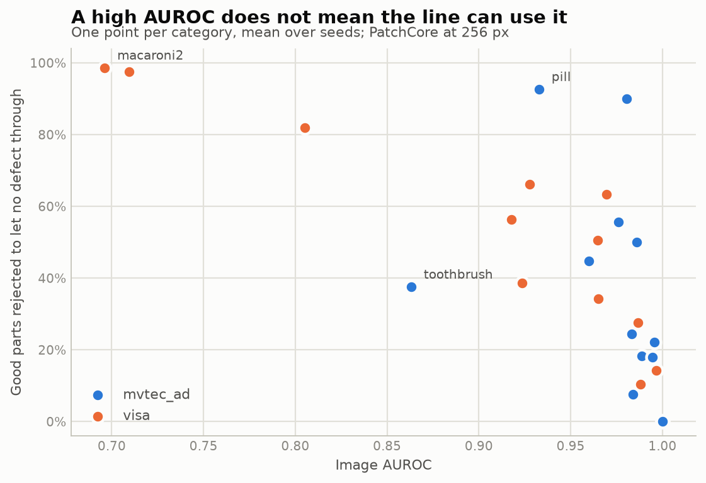

# ZeroNG

**Visual inspection for factories that have no defect (NG) images yet.**

A factory that wants automated inspection has thousands of good parts and, usually, no
photographs of defects at all. Every buyer asks the same three questions before signing:

1. **How many images do we need?** — data-efficiency curve, few-shot vs. zero-shot
2. **Will it survive our line?** — robustness to lighting, blur, misalignment
3. **Can it run on the PC we already own?** — CPU latency, PLC integration

ZeroNG answers them with measurements rather than claims. This repository is the work in
progress: **the evaluation protocol, the factory metrics and the first baselines are done**
(weeks 1–2 of a 10-week plan); the robustness suite, synthetic defects and the CPU demo are not.
The roadmap at the bottom says what exists and what does not.

## The metric that decides the sale

An inspection line has two failure modes, and they do not cost the same:

- **Escape** — a defective part passed as good. It reaches the customer. Expensive.
- **False reject** — a good part scrapped or sent to manual review. Merely wasteful.

Most papers report image AUROC, which averages over every threshold and therefore over
operating points no factory would ever choose. ZeroNG's primary metric is the one a plant
manager can act on: **the false reject rate at zero escape** — if the line must not ship a
single defect, how much good product does the model throw away? The tables below report it
next to AUROC and AUPRO, so the gap between "looks excellent in a paper" and "usable on a
line" is visible in one row.

Because a factory with no defect images cannot pick a threshold from defect scores, each run
is scored at three thresholds:

| Threshold | Calibrated on | What it represents |
|---|---|---|
| **FRR @ 0 escape** | the test set itself | best case achievable by this score distribution, not deployable |
| **Val-cal** | real defects in `val` | a client who collected a handful of NG images |
| **Zero-NG** | held-out good images only | **the real starting point: no NG images at all** |

## Results

Generated by `scripts/make_tables.py` from logged MLflow runs — never edited by hand. Every
number traces back to a config, a seed and a git commit.

<!-- results:start -->
Macro averages over categories:

| Model | Dataset | Image AUROC | AUPRO | FRR @ 0 escape | Zero-NG FRR | Zero-NG escape |
|---|---|---|---|---|---|---|
| patchcore | mvtec_ad | 0.976 ± 0.036 | 0.931 ± 0.029 | 30.7% ± 30.8 | 13.9% ± 14.5 | 4.3% ± 6.3 |
| patchcore | visa | 0.904 ± 0.107 | 0.867 ± 0.060 | 53.3% ± 29.7 | 1.2% ± 2.3 | 52.5% ± 27.1 |



### patchcore on mvtec_ad

| Category | Image AUROC | Pixel AUROC | AUPRO | FRR @ 0 escape | Zero-NG FRR | Zero-NG escape | Val-cal FRR | Val-cal escape | Seeds |
|---|---|---|---|---|---|---|---|---|---|
| bottle | 1.000 ± 0.000 | 0.985 ± 0.000 | 0.952 ± 0.000 | 0.0% ± 0.0 | 0.0% ± 0.0 | 0.0% ± 0.0 | 0.0% ± 0.0 | 12.1% ± 1.3 | 3 |
| cable | 0.983 ± 0.002 | 0.984 ± 0.000 | 0.925 ± 0.002 | 24.4% ± 12.2 | 8.9% ± 1.4 | 2.6% ± 0.9 | 20.3% ± 10.2 | 1.0% ± 0.9 | 3 |
| capsule | 0.986 ± 0.002 | 0.989 ± 0.000 | 0.919 ± 0.002 | 50.0% ± 6.2 | 2.1% ± 3.6 | 7.9% ± 3.9 | 12.5% ± 10.8 | 2.6% ± 0.0 | 3 |
| carpet | 0.980 ± 0.002 | 0.991 ± 0.000 | 0.945 ± 0.001 | 90.0% ± 5.0 | 38.3% ± 2.9 | 1.6% ± 0.0 | 5.0% ± 0.0 | 4.3% ± 0.9 | 3 |
| grid | 0.976 ± 0.003 | 0.981 ± 0.000 | 0.922 ± 0.001 | 55.6% ± 19.2 | 13.3% ± 0.0 | 4.2% ± 1.4 | 0.0% ± 0.0 | 15.8% ± 2.9 | 3 |
| hazelnut | 1.000 ± 0.000 | 0.988 ± 0.000 | 0.952 ± 0.000 | 0.0% ± 0.0 | 0.0% ± 0.0 | 0.7% ± 1.2 | 0.0% ± 0.0 | 2.7% ± 1.2 | 3 |
| leather | 1.000 ± 0.000 | 0.992 ± 0.000 | 0.974 ± 0.000 | 0.0% ± 0.0 | 7.6% ± 6.9 | 0.0% ± 0.0 | 0.0% ± 0.0 | 3.6% ± 0.9 | 3 |
| metal_nut | 0.995 ± 0.002 | 0.987 ± 0.000 | 0.943 ± 0.001 | 22.2% ± 3.8 | 15.6% ± 3.8 | 1.0% ± 0.9 | 0.0% ± 0.0 | 6.8% ± 0.9 | 3 |
| pill | 0.933 ± 0.005 | 0.983 ± 0.000 | 0.949 ± 0.001 | 92.6% ± 3.2 | 11.1% ± 0.0 | 19.0% ± 3.1 | 75.9% ± 3.2 | 2.7% ± 0.6 | 3 |
| screw | 0.960 ± 0.004 | 0.988 ± 0.000 | 0.939 ± 0.001 | 44.8% ± 9.1 | 8.0% ± 2.0 | 18.1% ± 3.6 | 28.7% ± 8.7 | 2.8% ± 1.8 | 3 |
| tile | 1.000 ± 0.000 | 0.954 ± 0.000 | 0.850 ± 0.000 | 0.0% ± 0.0 | 0.0% ± 0.0 | 7.2% ± 1.0 | 0.0% ± 0.0 | 6.7% ± 1.7 | 3 |
| toothbrush | 0.863 ± 0.006 | 0.989 ± 0.000 | 0.910 ± 0.000 | 37.5% ± 0.0 | 50.0% ± 0.0 | 0.0% ± 0.0 | 37.5% ± 0.0 | 0.0% ± 0.0 | 3 |
| transistor | 0.989 ± 0.006 | 0.973 ± 0.000 | 0.950 ± 0.000 | 18.3% ± 7.3 | 19.8% ± 1.4 | 1.2% ± 2.1 | 5.6% ± 1.4 | 3.6% ± 0.0 | 3 |
| wood | 0.995 ± 0.000 | 0.956 ± 0.000 | 0.901 ± 0.001 | 17.9% ± 4.4 | 25.6% ± 4.4 | 0.0% ± 0.0 | 38.5% ± 0.0 | 0.0% ± 0.0 | 3 |
| zipper | 0.984 ± 0.003 | 0.982 ± 0.000 | 0.938 ± 0.000 | 7.6% ± 2.6 | 7.6% ± 2.6 | 0.8% ± 0.7 | 68.2% ± 7.9 | 0.0% ± 0.0 | 3 |
| **mean** | 0.976 ± 0.036 | 0.982 ± 0.012 | 0.931 ± 0.029 | 30.7% ± 30.8 | 13.9% ± 14.5 | 4.3% ± 6.3 | 19.5% ± 25.4 | 4.3% ± 4.5 | 3 |

### patchcore on visa

| Category | Image AUROC | Pixel AUROC | AUPRO | FRR @ 0 escape | Zero-NG FRR | Zero-NG escape | Val-cal FRR | Val-cal escape | Seeds |
|---|---|---|---|---|---|---|---|---|---|
| candle | 0.970 ± 0.001 | 0.993 ± 0.000 | 0.958 ± 0.001 | 63.3% ± 10.5 | 0.0% ± 0.0 | 68.6% ± 2.5 | 6.7% ± 2.2 | 10.0% ± 2.9 | 3 |
| capsules | 0.709 ± 0.014 | 0.981 ± 0.000 | 0.755 ± 0.004 | 97.6% ± 0.0 | 2.4% ± 0.0 | 58.1% ± 4.6 | 97.6% ± 0.0 | 1.4% ± 1.4 | 3 |
| cashew | 0.965 ± 0.001 | 0.991 ± 0.000 | 0.918 ± 0.001 | 34.3% ± 0.0 | 0.0% ± 0.0 | 48.1% ± 0.8 | 46.7% ± 4.4 | 0.0% ± 0.0 | 3 |
| chewinggum | 0.997 ± 0.001 | 0.993 ± 0.000 | 0.895 ± 0.003 | 14.3% ± 2.9 | 0.0% ± 0.0 | 4.8% ± 0.8 | 26.7% ± 16.2 | 1.0% ± 1.6 | 3 |
| fryum | 0.965 ± 0.003 | 0.950 ± 0.000 | 0.821 ± 0.002 | 50.5% ± 5.9 | 0.0% ± 0.0 | 43.8% ± 5.9 | 57.1% ± 5.7 | 0.0% ± 0.0 | 3 |
| macaroni1 | 0.805 ± 0.007 | 0.962 ± 0.003 | 0.836 ± 0.008 | 81.9% ± 7.3 | 0.0% ± 0.0 | 92.4% ± 0.8 | 76.7% ± 3.3 | 1.9% ± 1.6 | 3 |
| macaroni2 | 0.696 ± 0.016 | 0.968 ± 0.001 | 0.842 ± 0.005 | 98.6% ± 0.0 | 0.0% ± 0.0 | 100.0% ± 0.0 | 85.7% ± 4.9 | 4.8% ± 0.8 | 3 |
| pcb1 | 0.924 ± 0.002 | 0.995 ± 0.000 | 0.904 ± 0.005 | 38.6% ± 4.3 | 5.2% ± 0.8 | 47.6% ± 4.1 | 36.7% ± 7.3 | 1.9% ± 3.3 | 3 |
| pcb2 | 0.928 ± 0.003 | 0.982 ± 0.000 | 0.829 ± 0.004 | 66.2% ± 8.7 | 6.7% ± 0.8 | 24.3% ± 2.5 | 54.8% ± 16.7 | 1.9% ± 0.8 | 3 |
| pcb3 | 0.918 ± 0.003 | 0.981 ± 0.000 | 0.816 ± 0.003 | 56.3% ± 2.4 | 0.0% ± 0.0 | 55.7% ± 2.5 | 53.5% ± 2.8 | 1.9% ± 0.8 | 3 |
| pcb4 | 0.988 ± 0.002 | 0.984 ± 0.000 | 0.892 ± 0.002 | 10.3% ± 0.8 | 0.0% ± 0.0 | 60.0% ± 3.8 | 28.2% ± 7.5 | 0.0% ± 0.0 | 3 |
| pipe_fryum | 0.987 ± 0.002 | 0.990 ± 0.000 | 0.939 ± 0.001 | 27.6% ± 4.4 | 0.0% ± 0.0 | 26.7% ± 1.6 | 9.5% ± 1.6 | 6.7% ± 0.8 | 3 |
| **mean** | 0.904 ± 0.107 | 0.981 ± 0.014 | 0.867 ± 0.060 | 53.3% ± 29.7 | 1.2% ± 2.3 | 52.5% ± 27.1 | 48.3% ± 28.7 | 2.6% ± 3.0 | 3 |

Test split only (the protocol's held-out part of the official test set). Mean ± sample std over training seeds; the last row is the macro average over categories (± std across categories).

- **FRR @ 0 escape**: good parts rejected when the threshold catches every defect on test (threshold chosen on test: an achievable best case, like AUROC, not deployable).
- **Zero-NG**: threshold from held-out good images only (≤ 1% false rejects on `val_good`), applied to test. The setting of a factory with no defect images.
- **Val-cal**: threshold = lowest defect score on `val` (uses real defects), applied to test.

Provenance: 81 runs; git commit(s) 1a0ec9e1; hardware: x86_64 | NVIDIA GeForce RTX 3090.  
Generated by `uv run python scripts/make_tables.py --store remote_runs/patchcore-baseline-v4/mlflow.db --experiment baseline`.
<!-- results:end -->

### What these numbers say

- **A high AUROC does not mean the model is deployable.** Several categories score above 0.98
  AUROC yet have to reject a large share of good parts to let no defect through. The two
  columns disagree by category, so AUROC alone cannot rank models for a factory.
- **Calibrating without defect images is the hard part.** The zero-NG threshold keeps false
  rejects low, but on VisA it does so by letting a large fraction of defects escape — the
  failure a plant cannot accept. Closing that gap without real NG images is what the synthetic
  defect work (pillar 3) is for.
- **Even real defects in validation do not fix it.** Calibrating on a few dozen NG images
  still produces escapes on the test split: a threshold set at the lowest defect score is
  fragile by construction.
- **Multi-instance scenes are the weak spot.** The VisA categories with many small objects per
  image are far behind the single-object ones; a global image score dilutes a defect that
  covers a few percent of the frame.
- **The spread over seeds is small** compared to the spread between categories, so the ranking
  of categories is stable — PatchCore's only stochastic step is coreset subsampling.

## Evaluation protocol

MVTec-style datasets ship good training images and a mixed test set, with **no defect
validation split**. Tuning anything on the official test set leaks, so ZeroNG defines a
documented, seeded split (`src/zerong/data/splits.py`) and uses it for every number:

| Split | Content | Used for |
|---|---|---|
| `train` | good training images | fitting the model |
| `val_good` | good images held out of training (or the dataset's own validation set) | zero-NG threshold calibration |
| `val` | part of the official test set, stratified by defect type | oracle threshold calibration |
| `test` | the rest of the official test set | **final numbers only** |

The splits are deterministic given a seed, independent of file order, and the manifest is
logged with every run. Subsets for the data-efficiency curve are nested, so `k=5` contains the
`k=1` images and the curve measures added images rather than a new draw.

anomalib's default validation split is a copy of the test set, which would leak test data into
thresholds; `ManifestDataModule` replaces that logic with the manifest above.

## Reproduce

Requires [uv](https://docs.astral.sh/uv/). The venv uses Python 3.11 for anomalib/OpenVINO
compatibility; anomalib is pinned (its API changes between minor versions).

```bash
uv sync
uv run pytest                                    # metrics, splits and launcher unit tests
uv run python scripts/download_data.py --dataset mvtec_ad visa
uv run python scripts/run_baseline.py --config configs/patchcore_mvtec.yaml
uv run python scripts/make_tables.py --store mlflow.db --experiment baseline
```

Archives are verified against their SHA-256 before extraction. Runs are logged to a local
MLflow SQLite store with config, seed, git commit, hardware, the split manifest and per-image
scores.

GPU jobs run on rented hardware; the launcher clones the repo at a pushed commit, runs the
job, fetches results and destroys the instance, with a watchdog on the instance itself so a
dead launcher cannot leave a machine billing:

```bash
uv run python scripts/vast_job.py run --name baseline --gpu "RTX 3090" --max-dph 0.2 \
    --datasets mvtec_ad visa \
    --cmd "uv run python scripts/run_baseline.py --config configs/patchcore_mvtec.yaml"
```

## Limitations

Stated plainly, because a benchmark that hides its caveats is not worth reading:

- **Below published PatchCore numbers.** Images are resized to 256 px with no center crop, and
  the protocol evaluates on a subset of the official test set. Both choices are deliberate
  (deployment-like resolution, no test leakage) but they make the results not directly
  comparable to papers that report the full test set at 224 px center-cropped.
- **Small test splits make some rates coarse.** `toothbrush` ends up with single-digit good
  images in the test split, so its false reject rate moves in large steps and its AUROC is
  noisy.
- **One model family so far.** PatchCore only; EfficientAD is configured but not run. There are
  no zero-shot (WinCLIP/AnomalyCLIP) baselines yet, so "how many images do we need" is not yet
  answered.
- **`carpet` shows a train/test shift** that the zero-NG threshold is sensitive to; it is
  flagged for analysis, not explained yet.
- **No robustness, synthetic-defect or CPU-latency results yet.** The deployment claims in the
  pitch are not measured; that is weeks 4–9.

## Datasets

Public datasets only, downloaded by `scripts/download_data.py`; licenses are recorded in
[`data/LICENSES.md`](data/LICENSES.md) before first use.

| Dataset | Role | Commercial use |
|---|---|---|
| MVTec AD | standard baseline, comparability with papers | no (CC BY-NC-SA 4.0) |
| VisA | multi-instance, PCB-like: electronics factories | yes, with attribution (CC BY 4.0) |
| MVTec AD 2 | harder scenes, unseen lighting in the private test sets | no (CC BY-NC-SA 4.0) |

MVTec datasets are non-commercial: this repository is research/portfolio work, and models
trained on them must not be used commercially.

## Layout

```
configs/        one YAML per experiment
scripts/        download_data, run_baseline, make_tables, vast_job
src/zerong/
  data/         seeded split protocol + anomalib adapter
  metrics/      FRR at zero escape, thresholds, cost model, AUROC/AUPRO
  models/       anomalib model registry
  remote/       rented-GPU job launcher
  reporting.py  run aggregation for the tables above
experiments/    committed results (CSV, generated tables)
tests/          unit tests for everything that carries a number
```

## Roadmap

| | Pillar | Status |
|---|---|---|
| 1 | Data-efficiency curve (k ∈ {1, 5, 10, 50, 200}) vs. zero-shot baselines | not started |
| 2 | Robustness benchmark: lighting, glare, blur, noise, misalignment | not started |
| 3 | Synthetic defects; thresholds calibrated with no real NG | not started |
| 4 | Factory metrics: FRR at zero escape, three-way OK/NOT CLEAR/NG, cost model | metrics done, decision + cost model pending |
| 5 | Deployment: OpenVINO export, CPU latency, conveyor sim, Modbus PLC, operator UI | not started |

Baselines (weeks 1–2) are complete for PatchCore on MVTec AD and VisA.
